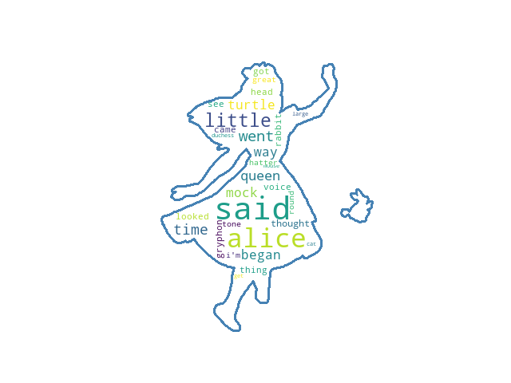

# 오늘 처음 블로그를 만들었어요.

노션으로 할지, 깃허브로 할지 고민이네요.




```python
class <ClassName>:

    <class_attribute_name> = <value>

    def __init__(self,<param1>, <param2>, ...):
        self.<attr1> = <param1>
        self.<attr2> = <param2>
        .
        .
        .
        # As many attributes as needed
    
   def <method_name>(self, <param1>, ...):
       <code>
       
   # As many methods as needed
```


#### 깃헙 블로그 만들기 쉽지 않네요


